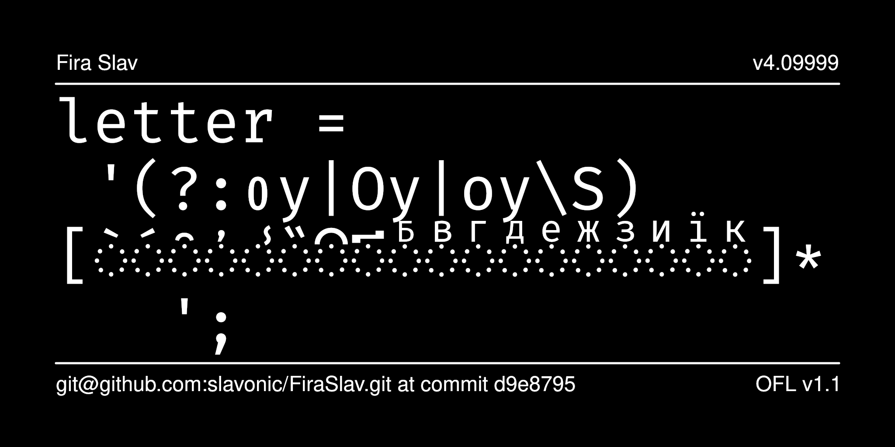

# FiraSlav Typeface

FiraSlav is a monospaced font for Church Slavonic.

Editing Church Slavonic text in a text editor can be complicated because
stacking diacritical marks are difficult to visually identify and correct.
This font treats all diacritical marks and combining letters as spacing
symbols and maintains a monospaced appearance, ideal for text editing projects.



## History

- Based on [Fira Mono 3.2](https://github.com/bBoxType/FiraSans)
- Fira is a trademark of The Mozilla Corporation.
- Digitized data copyright 2012-2018, The Mozilla Foundation and Telefonica S.A., bBox Type GmbH and Carrois Corporate GbR, with Reserved Font Name "Fira" 
- Design 2012-2015: Carrois Corporate GbR & Edenspiekermann AG
- Design 2016 and later: bBox Type GmbH
- Additional Design 2019: Aleksandr Andreev

_ _ _ _ _ _ _ _ _ _ _ _ _ _ _ _ _ _ _ _

## Fira Slav font weights:

* Regular 		(84em / CSS 400)
* Bold  		(158em / CSS 700)
_ _ _ _ _ _ _ _ _ _ _ _ _ _ _ _ _ _ _ _

## License

This Font Software is licensed under the SIL Open Font License,
Version 1.1. This license is available with a FAQ at
[https://openfontlicense.org/](https://openfontlicense.org/).
_ _ _ _ _ _ _ _ _ _ _ _ _ _ _ _ _ _ _ _

## Building the Fonts

The Google font building tools do not work correctly for this font as
they generate fonts where the combining characters are non-spacing, which
is exactly what we don't want. So the fonts are built directly from the 
FontForge source. So you must have Python and FontForge installed.

To build the fonts, run from terminal:

```

make build

```

To build the sample images, run:

```

make images

```

## More Church Slavonic Fonts

See the [main repository](https://github.com/typiconman/fonts-cu/issues) and the [website](https://sci.ponomar.net/fonts.html).
